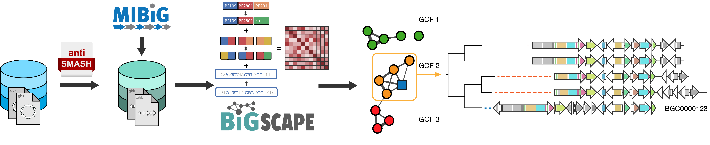

## _Note: BiG-SCAPE 2.0 is still in beta. Please submit an issue if you find anything wrong with this release!_

# BiG-SCAPE

**BiG-SCAPE** (Biosynthetic Gene Similarity Clustering and Prospecting Engine) is a software package, written in Python, that constructs sequence similarity networks of Biosynthetic Gene Clusters (BGCs) and groups them into Gene Cluster Families (GCFs). BiG-SCAPE does this by calculating pairwise distances between gene clusters based on a comparison of their protein domain content, order, copy number and sequence identity.

BiG-SCAPE uses [antiSMASH](https://antismash.secondarymetabolites.org) processed GenBank files, i.e. BGC predictions, as well as reference BGC GenBank files (user-defined and/or [MIBiG](https://mibig.secondarymetabolites.org) repository). BiG-SCAPE outputs tab-delimited output files, a comprehensive SQLite database which stores all the generated results, and a rich HTML visualization that includes the BGC similarity network and [CORASON](https://github.com/nselem/corason)-like, multi-locus phylogenies of each Gene Cluster Family.

In principle, BiG-SCAPE can also be used on any other gene clusters, such as pathogenicity islands, secretion system-encoding gene clusters, or even whole viral genomes.

For installation instructions, see [here](https://github.com/medema-group/BiG-SCAPE/wiki/Installing-and-Running-BiG-SCAPE).

Learn more about BiG-SCAPE in the [wiki](https://github.com/medema-group/BiG-SCAPE/wiki).

If you find BiG-SCAPE useful, please cite us:

[A computational framework to explore large-scale biosynthetic diversity](https://doi.org/10.1038/s41589-019-0400-9)
